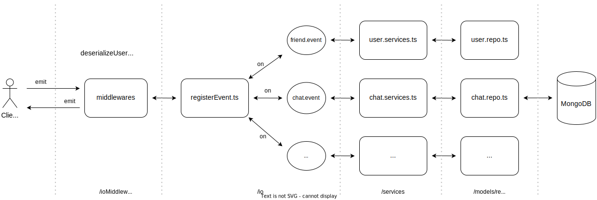

### Summary

This is a chat application, with basic features, created for research and learning purposes

### Prerequisites
To run the code, the machine needs to install **Node** environment, specifically the entire project is developed with **Node 20.11** and deploy with **node:20-alpine** environment

### Technologies used in the project

##### Backend
- Express & Typescript
- Validation with Zod
- Nodemailer through Gmail 
- MongoDB database & Mongoose ODM
- SocketIO 

##### Frontend
- React & Typescript
- Redux & Redux toolkit for state management
- Axios for REST Api requests
- Form handling and validation using React-Hook-Form & Zod
- Radix UI library & Tailwind CSS

##### Deployment
- Personal VPS (Ubuntu)
- Docker

##### Others
- Prettier & Eslint
- Git

### Main features

##### Token-based (JWT) Authentication & authorization
- Verify email with OTP code by Nodemailer through Gmail 
- Sign up 
- Sign in/ Sign out
- Refresh access token using Refresh token rotation technique
- Request reset password code through Gmail 
- Update new password

##### User features
- Get current user information 
- Update current user information
- Get other users 

##### Friend features
- get friends of current user
- get friend requests of current user
- request add friend to another user
- cancel friend request 
- accept/reject friend request from another user 
- unfriend 
 
##### Chat One To One features
- get all individual chats 
- send/receive text message
- show the 'sent/seen' status of the last message in real time 
- show the number of unread messages of each chat

##### Chat Group features
- get all group chats 
- send/receive text message 
- show the 'sent/number people had seen' status of the last message in real time 
- show the number of unread messages of each chat

### Folder structure & Processing flow
The entire project is divided into 3 main folders
- **/be**: handles http requests according to rest api standards
- **/realtime**: handles real time event with socketIO library
- **/fe**: taking full responsibility for the frontend

##### Backend ('/be')
There are 3 main folders in **/be/src**: 
- **/routes**: defines resource urls, apply middleware (error, not found and validation handler)
- **/controllers**: get payload fields and call necessary services
- **/services**: contains the main logic processing 

    
##### Realtime services ('/realtime')
There are 3 main folders in **/realtime/src**: 
- **/io**: list events and subscribe to them
- **/ioMiddelewares**: apply middleware (authentication, validation handler)
- **/services**: contains the main logic processing 

##### frontend ('/fe')
There are 8 main folders in **/fe/src**: 
- **/components**: contains child components of pages and reusable components
- **/pages**: contains components that are application pages
- **/routes**: defines the corresponding paths and components
- **/realtime**: register to listen to events from the realtime server and contain emit functions of events
- **/redux**: defines the general store, corresponding slices and reducers
- **/form** & **/lib/formSchema**: form components will be stored in the '/form' folder. '/lib/formSchema' contains the schemas defined by zod used for validating forms
- **/theme**: define color codes and text properties

### Database diagram

### Appendix
#### List of REST APIs

##### Authentication & authorization
|Method|Resource|Description|
|---|---|---|
|POST|/v1/api/users/request-verify-otp|request OTP code by Nodemailer through Gmail|
|POST|/v1/api/users/verify|verify email with OTP code|
|POST|/v1/api/users/|sign up|
|POST|/v1/api/auth/sign-in|sign in|
|POST|/v1/api/auth/sign-out|sign out|
|POST|/v1/api/auth/refresh|refresh access token using Refresh token rotation technique|
|POST|/v1/api/auth/forgot-password|request reset password code through Gmail|
|POST|/v1/api/auth/reset-password/:userId/:passwordResetCode|update new password|

##### User features
|Method|Resource|Description|
|---|---|---|
|GET|/v1/api/users/me|get current user information|
|PATCH|/v1/api/users/|update current user information|
|GET|/v1/api/users/get-others|get other users|

##### Friend features
|Method|Resource|Description|
|---|---|---|
|GET|/v1/api/friends/|get friends of current user|
|GET|/v1/api/friends/requests/|get friend requests of current user|
 
##### Chat One To One features
|Method|Resource|Description|
|---|---|---|
|GET|/v1/api/chat/individual/|get all individual chats|
|GET|/v1/api/chat/individual/:chatOneToOneId|get the details of a chat (messages, status of the last message)|

##### Chat Group features
|Method|Resource|Description|
|---|---|---|
|GET|/v1/api/chat/group/|get all group chats|
|GET|/v1/api/chat/group/:chatGroupId|get the details of a chat (messages, status of the last message)|

#### List of Realtime Event with SocketIO

##### Friend events
|Event name|Description|
|---|---|
|friend:send_request||
|friend:new_request||
|friend:request_success||
|friend:accept_request||
|friend:accepted_success||
|friend:new_friend||
|friend:cancel_request||
|friend:cancel_success||    
|friend:reject_request||
|friend:reject_success||
|friend:un_friend||
|friend:un_friend_success||

##### Chat events
|Event name|Description|
|---|---|
|chat:send_message||
|chat:new_message||
|chat:clear_unread||
|chat:user_seen||

##### Group events
|Event name|Description|
|---|---|
|group:create||
|group:create_success||
|group:send_message||
|group:new_message||
|group:clear_unread||
|group:user_seen||

